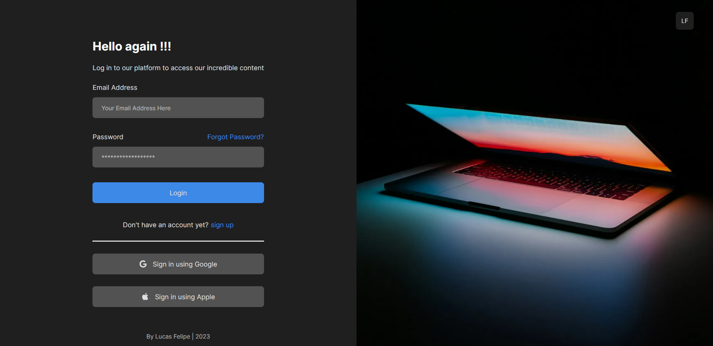

# Login Page 🚀

## Descrição ✏️
Bem-vindo ao meu projeto de Login Page, aventura que marcou o início da minha trajetória no mundo do desenvolvimento web! Este projeto é realmente especial para mim, pois representa um marco importante, sendo uma das minhas primeiras experiências completas, desde o design até a implementação do código.

Com a utilização das tecnologias HTML5, CSS3 e JavaScript, desenvolvi uma página de login excepcional, que combina funcionalidade e um design moderno e atrativo.

No desenvolvimento acabei utilizando os medias querys para deixar o layout responsivos, assim sendo possível utilizar desde um desktop ao mobile, além disso fiz um pequeno tratamento de dados no formulário via Javascript.

Sobre o design comecei esboçando wireframes à moda antiga mesmo, com papel e caneta, para visualizar o layout. Em seguida, trabalhei no modelo de baixa fidelidade, onde cada elemento começou a tomar forma. E, por fim, criei o modelo de alta fidelidade, refinando cada parte e polindo os detalhes até atingir o nível de excelência que eu desejava.

## Recursos 🤔
- Página de login com design moderno e responsivo.
- Validação de formulário em tempo real usando JavaScript.
- Uma experiência de usuário fluida e intuitiva.  
<br>



## Como Usar 👨🏻‍💻
Você pode acessar a página de login diretamente pelo link [aqui](https://lfeli.github.io/Project-Login_page/) sem seguir as etapas abaixo. Mas se preferir, siga estas etapas para obter o projeto em sua máquina local:

1. Faça um clone do repositório utilizando o Git no terminal:
```bash
git clone https://github.com/LFeli/Project-Login_page.git
cd Project-Login_page
```
2. Abra o arquivo "index.html" no seu navegador preferido.